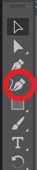
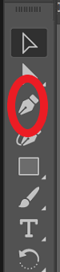
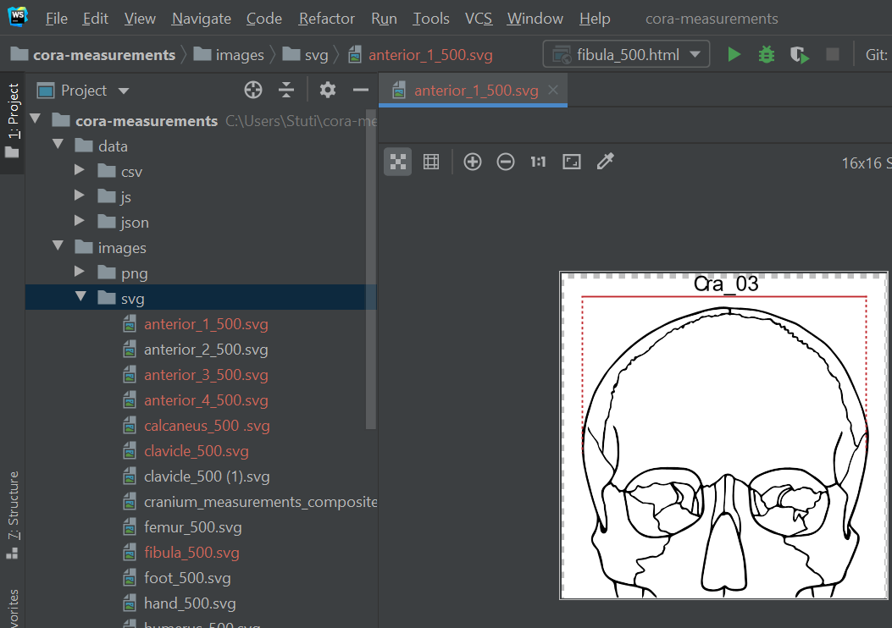

CoRA Measurement Documentation
==============================

Purpose:

This document outlines procedures to convert PNG images into the SVG
(Scalable Vector Graphics) format, and display measurement of different
parts of the bone from the corresponding json file in a dialog box, for
the CoRA project.

Background:
-----------

SVGs are vector images composed of mathematical equations, where the
lines and curves (or paths) make up graphic shapes, images and text, in
the XML format \[1\]. SVGs are supported by most modern browsers
(including Chrome, Firefox, and Safari), and have a similar structure to
HTML. SVG images have many advantages over raster images (.jpeg, .gif,
.png) such as:

-   SVG images are resolution-independent and can scale to any dimension
    without losing quality

-   SVG can manipulate vectors in a code or text editor

-   SVG can be modified using CSS and JavaScript

-   SVG images can be searched, indexed, scripted, and compressed

-   SVG images can be created and edited with any text editor

-   SVG graphics do NOT lose any quality if they are zoomed or resized
    \[2\]

Due to these advantages of SVG images, the CoRA project is using this
image format.

Procedures:
-----------

A step by step procedure to convert a \*.png file into a \*.svg file is
listed below:

1.  First, clone the measurement project from GitHub
    (<https://github.com/spawaskar-cora/cora-measurements>)

2.  The project contains images of various bones required for the
    measurement in PNG format (cora-meaurements/images/png); Make a copy
    of the images into a SVG folder to convert them.

3.  Start Adobe Illustrator (*The industry-standard vector graphics app
    to create logos, icons, drawings, typography and illustrations for
    print, web, video and mobile).*

4.  Open one of the copied PNG images

5.  Resize the image into a viewable size using the "Shift" key and
    mouse (Holding down the "Shift" key ensures the ratio of the image
    is maintained when resizing)

    

6.  Click the action button "Image trace" at the right and set it to
    default

    

7.  Click the "Image Trace" option panel to adjust the image threshold

    
8.  Using the options (Threshold, Paths, Corners and Noise), edit the
    image

    -   Threshold: It is the value for generating a black-and-white tracing
    result from the original image

    -   Paths: Used for controlling the distance between the traced path
    shape and the original path shape. The lower the value, the tighter
    the path fits; the higher the value, the looser the path fits.

    -   Corners: It specifies the corner appearance. A higher value results
        in more corners.
    
    -   Noise: It determines the pixel area that is ignored while tracing

     

9.  Close the Image Trace panel and click "Expand' at the right to
    complete vector tracing

    

10. The image will be highlighted in blue as shown below

    (Note: When one of the lines is selected, the whole image gets
    selected)

      

11. Since we are trying to get the measurement of each line in the bone,
    replace each line to ensure only one line at a time gets selected
    and is in a different layer. Erase the old line (using eraser and
    Curvature from toolbar - adjust the size and angle of the eraser
    using the "Enter" key).

    -   Make sure the background does not get deleted while delete the line
        and there is no white space as well

        

        

    -   Draw a new line using the "Pen" tool from the tool bar.

        
    -   Double click the line and use "stroke" option under Appearance
    window at the right side to change the color, add dash, increase or
    decrease width, put arrowhead etc.```

     

    -   Repeat step 11 for all the required lines in the image

12. After replacing all the lines, save it as a .svg file and export it
    using inline CSS styling.

    

    

13. Save the edited SVG image into the cloned project under svg folder
    in WebStorm.

    

14. Next step is to write the JavaScript code (vanilla JS) to display
    measurement of the bone from the corresponding json file
    "bone\_measurements.json" in a dialog box.

    The JS is written externally with .js extension instead of writing
    the same script repeatedly.

    
    -   After that, the JS is called from the svg using \<script
        href=""\> tag.

        {width="5.535357611548556in" height="2.375in"}

    -   Make sure to reformat the svg code in an appealing way to make it
    easier for anyone to read the code. Make sure each tag such as
    \<path\> \<line\> starts in a new code and in order to do that you
    can search for the "\>\<path" in the code and click enter.

References
==========

  -- --
     
  -- --

\[1\] \[Online\]. Available:
https://explaineverything.com/5-advantages-using-svgs/.\[2\] \[Online\].
Available: https://www.w3schools.com/graphics/svg\_intro.asp.
